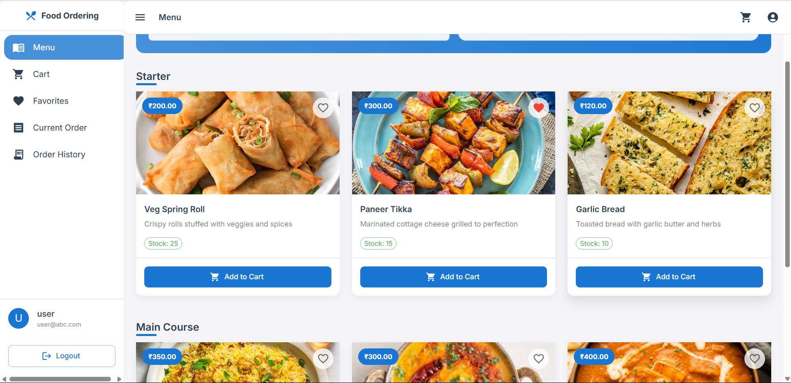
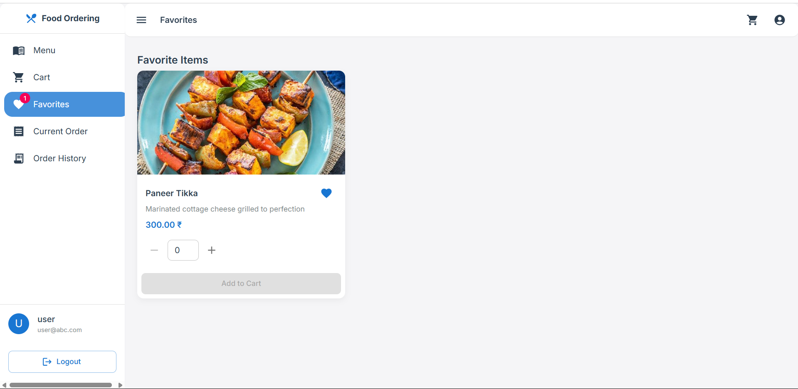
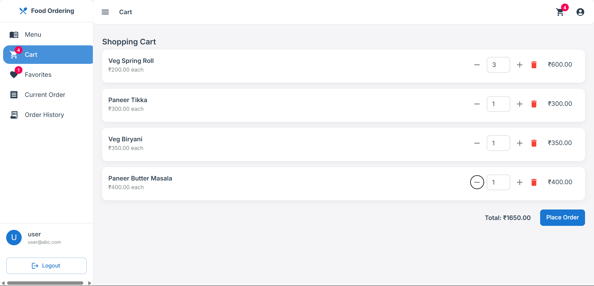
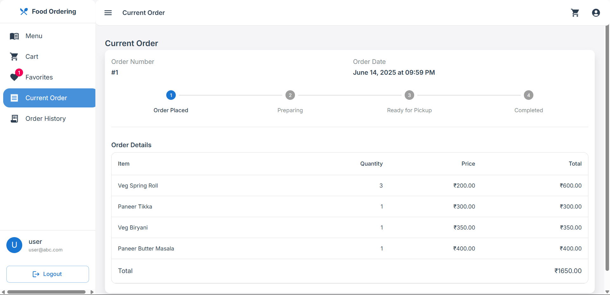
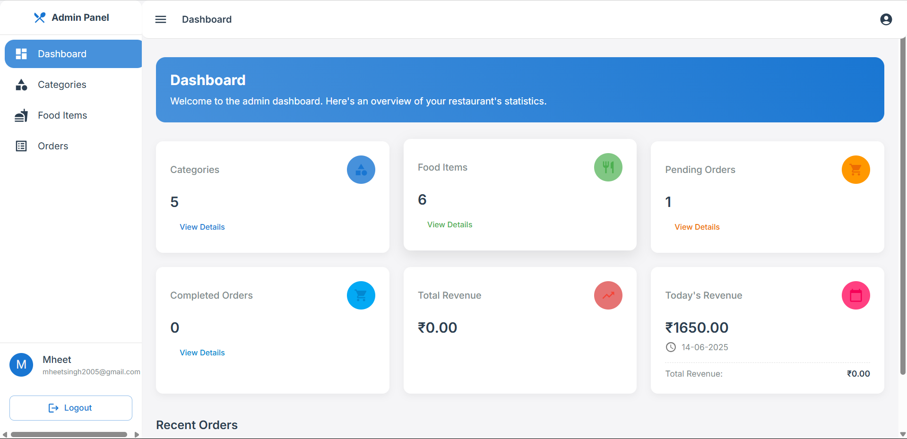
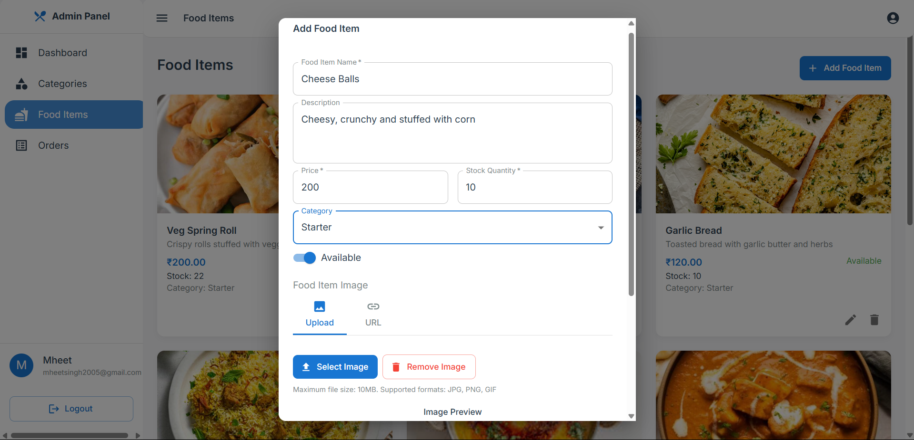

# 🍽️ Canteen Order System

A full-stack web application to digitize and streamline food ordering in college canteens — cutting down the manual chaos for both users and admins.

---

## 🎯 Features

### 👥 User Features

* Register & login securely
* Browse categorized food items
* Add to cart & place orders
* Track live order status
* View order history
* Mark favorites for faster reordering

### 🔧 Admin Features

* Add, edit, and delete food items & categories
* Manage stock in real-time
* Monitor and process live orders
* View revenue analytics and user stats
* Access a clean dashboard for overall control

---

## 🛠️ Tech Stack

### Frontend

* React.js
* Tailwind CSS
* React Router
* Axios
* Context API

### Backend

* Node.js
* Express.js
* MySQL
* Multer (for image uploads)
* Sharp (for image processing)

---

## 📸 Screenshots

### 🧾 User Menu
Browse food items with categories and images.


### ❤️ Favorite Items
Users can mark favorite dishes for quick access.


### 🛒 Cart View
Add items to cart and place orders easily.


### 🔄 Track Current Orders
Track your placed orders in real-time.


### 🧑‍💼 Admin Dashboard
Admin panel showing overview and stats.


### ➕ Add New Food Item
Admin can add new food items via form.


---

## ⚙️ Getting Started

### 1. Clone the Repository

```bash
git clone https://github.com/Mheet/Canteen-Order-System.git
cd Canteen-Order-System
```

### 2. Install Dependencies

#### Backend

```bash
cd backend
npm install
```

#### Frontend

```bash
cd ../frontend
npm install
```

### 3. Set Up the Database

* Create a MySQL database named `foodsystem`
* Import the provided `database_schema.sql` file from the root directory

### 4. Configure Environment Variables

In the `backend` folder, create a `.env` file with:

```env
DB_HOST=localhost
DB_USER=your_mysql_user
DB_PASSWORD=your_mysql_password
DB_NAME=foodsystem
PORT=3000
```

---

## 🚀 Running the Application

### Start Backend

```bash
cd backend
node server.js
```

### Start Frontend

```bash
cd frontend
npm run dev
```

App will run at:

* Frontend: `http://localhost:5173`
* Backend API: `http://localhost:3000`

---

## 🗂️ Project Structure

```
canteen-order-system/
├── backend/
│   ├── server.js
│   ├── uploads/
│   └── .env
├── frontend/
│   ├── src/
│   │   ├── components/
│   │   ├── pages/
│   │   ├── services/
│   │   └── App.jsx
│   └── vite.config.js
├── images/
├── database_schema.sql
└── README.md
```

---

## 🔌 API Endpoints

### 🔐 Authentication

* `POST /api/register` - Register user
* `POST /api/login` - User login

### 🍔 Food Items

* `GET /api/food-items`
* `POST /api/food-items`
* `PUT /api/food-items/:id`
* `DELETE /api/food-items/:id`

### 📂 Categories

* `GET /api/categories`
* `POST /api/categories`
* `PUT /api/categories/:id`
* `DELETE /api/categories/:id`

### 🧾 Orders

* `GET /api/orders`
* `POST /api/orders`
* `PUT /api/orders/:id/status`
* `GET /api/orders/:id/details`

---

## 🤝 Contributing

1. Fork the repo
2. Create a new branch (`git checkout -b feature/MyFeature`)
3. Commit your changes (`git commit -m "Add MyFeature"`)
4. Push to the branch (`git push origin feature/MyFeature`)
5. Create a Pull Request

---

## 📜 License

This project is licensed under the [MIT License](LICENSE)

---

## 📬 Contact

**Mheet Singh**
- **GitHub:** [@Mheet](https://github.com/Mheet)
- **LinkedIn:** [@Mheet](https://www.linkedin.com/in/mheet/)
- **Project Repo:** [Canteen Food Ordering System](https://github.com/Mheet/Canteen-Food-Ordering-System)


---

